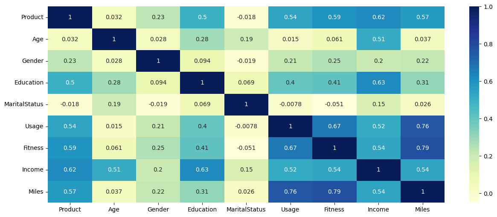

# 🏃 AeroFit Customer Profiling Analysis

## 📌 Overview
This project analyzes customer demographics and purchasing behavior to identify customer segments for AeroFit treadmills using descriptive statistics and probability analysis.

## 🎯 Business Problem
AeroFit wants to understand:
- Who purchases each treadmill model?
- Which customers are likely to buy premium products?
- How can marketing campaigns be optimized?

## 🛠 Tech Stack
- Python
- Pandas
- NumPy
- Matplotlib
- Seaborn

## 📂 Dataset
- 180 Customer Records
- 9 Features

## 📊 Analysis
- Data Cleaning
- Customer Segmentation
- Descriptive Statistics
- Outlier Detection
- Correlation Analysis
- Marginal Probability
- Conditional Probability
- Business Profiling

## 📈 Key Insights
- KP281 dominates overall sales.
- Premium KP781 customers have higher income and fitness levels.
- Male customers have a higher probability of purchasing KP781.
- Income and fitness strongly influence premium purchases.

## 💡 Business Recommendations
- Target premium customers with personalized marketing.
- Promote KP781 to high-income fitness enthusiasts.
- Reposition KP481 to reduce product cannibalization.
- Introduce bundle offers for partnered customers.

## 📁 Project Structure

AeroFit-Customer-Analysis/
```
├── AeroFit.ipynb
├── Dataset/
├── Images/
└── Report.pdf
## 📊 Correlation Heatmap



## 🚀 Skills Demonstrated
- Python
- Customer Analytics
- Probability
- EDA
- Business Analytics
- Data Visualization
- Customer Segmentation

## 👨‍💻 Author
**Rohan Jha**

⭐ Star this repository if you found it useful.
