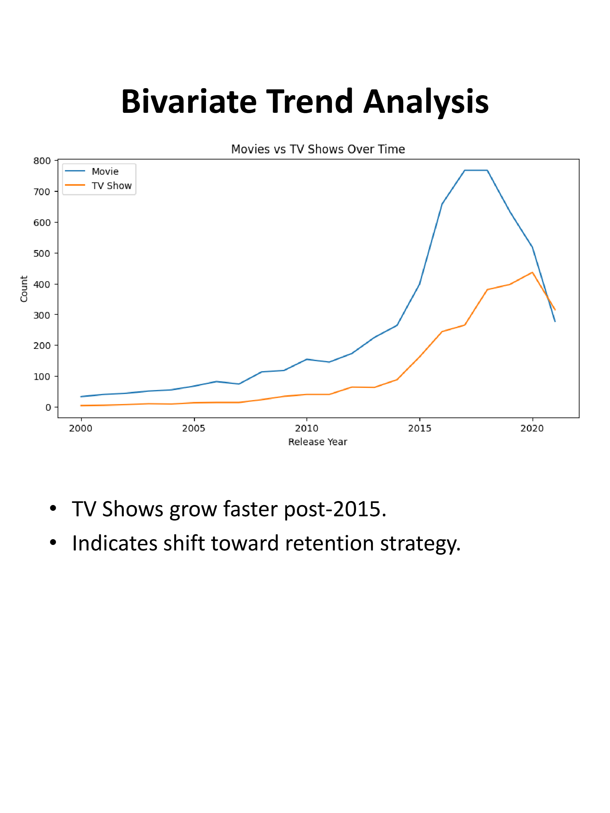
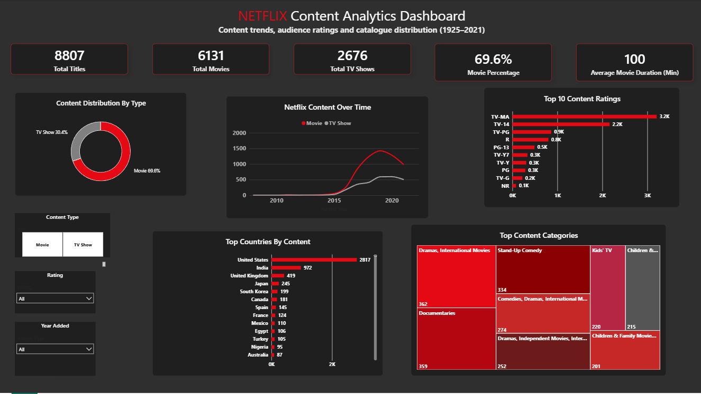

# 🎬 Netflix Content Strategy Analysis

## 📌 Overview
This project analyzes Netflix's content catalog using Python to identify trends, understand content distribution, and provide strategic business recommendations for content investment and subscriber retention.

## 🎯 Business Problem
Netflix wants to understand:
- Which content type drives engagement?
- Which countries contribute the most content?
- How has the catalog evolved over time?
- Which genres dominate the platform?

## 🛠 Tech Stack
- Python
- Pandas
- NumPy
- Matplotlib
- Seaborn
- Google Colab

## 📂 Dataset
- 8,807 Netflix Movies & TV Shows
- 12+ Features

## 📊 Analysis Performed
- Data Cleaning
- Missing Value Treatment
- Feature Engineering
- Exploratory Data Analysis
- Country Analysis
- Genre Analysis
- Rating Analysis
- Release Trend Analysis
- Data Visualization

## 📈 Key Insights
- Movies account for nearly 70% of the catalog.
- TV Shows have grown rapidly after 2015.
- USA and India contribute the highest number of titles.
- International Movies and Dramas dominate the catalog.
- TV-MA is the most common audience rating.

## 💡 Business Recommendations
- Increase investment in original TV Shows.
- Expand localized content production.
- Launch flagship content during peak engagement months.
- Continue investing in international markets.

## 📁 Project Structure

## 📁 Project Structure

```
Netflix-Content-Analysis/
├── Netflix_Analysis.ipynb
├── Dataset/
├── Images/
└── Presentation.pdf
```

## Bivarte Trend Analysis


## 🚀 Skills Demonstrated
- Python
- EDA
- Data Cleaning
- Feature Engineering
- Data Visualization
- Business Analytics
- Storytelling with Data

## 👨‍💻 Author
**Rohan Jha**

⭐ Star this repository if you found it useful.
---

## Netflix Power BI Dashboard

Developed an interactive Power BI dashboard to analyze 8,807 Netflix titles across content type, ratings, countries, categories, and catalogue growth.

### Dashboard Preview



### Key Insights

- Movies account for 69.6% of the catalogue.
- The dataset contains 6,131 movies and 2,676 TV shows.
- The average movie duration is approximately 100 minutes.
- TV-MA and TV-14 are the most common content ratings.
- The United States, India, and the United Kingdom lead in content volume.
- Netflix content additions increased significantly after 2015.

### Dashboard Features

- Interactive filters for content type, rating, and year added
- KPI cards for major catalogue metrics
- Movies versus TV shows distribution
- Content addition trends over time
- Top content ratings and countries
- Leading content categories

### Tools Used

- Power BI
- Power Query
- DAX
- Data Cleaning
- Data Visualization
- Dashboard Design
