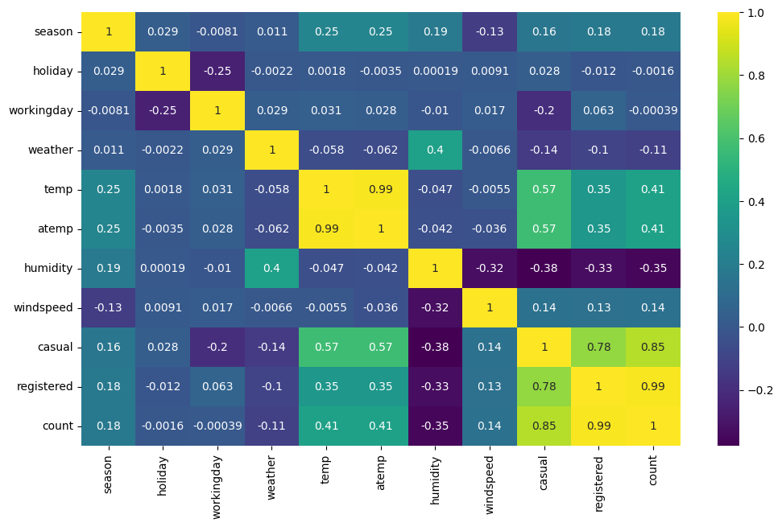

# 🚲 Yulu Bike Demand Analysis

## 📌 Overview
This project analyzes Yulu's bike rental data to identify factors affecting demand using Exploratory Data Analysis and Statistical Hypothesis Testing.

## 🎯 Business Problem
Yulu experienced a decline in revenue and wanted to identify factors influencing bike rentals.

Questions answered:
- Does weather affect demand?
- Does season impact rentals?
- Are weekdays different from weekends?
- Which variables influence customer demand?

## 🛠 Tech Stack
- Python
- Pandas
- NumPy
- Matplotlib
- Seaborn
- SciPy

## 📂 Dataset
- 10,886 Records
- 12 Features

## 📊 Analysis
- Data Cleaning
- Univariate Analysis
- Bivariate Analysis
- Correlation Analysis
- Hypothesis Testing
- T-Test
- Kruskal-Wallis Test
- Chi-Square Test

## 📈 Key Insights
- Weekday demand is higher than weekend demand.
- Weather significantly impacts rentals.
- Season affects bike demand.
- Temperature positively influences rentals.
- Weather and season are statistically dependent.

## 💡 Recommendations
- Increase bike availability during weekdays.
- Optimize inventory based on weather forecasts.
- Focus marketing campaigns during high-demand seasons.
- Improve availability in favorable weather conditions.

## 📁 Project Structure

Yulu-Demand-Analysis/
```
├── Yulu.ipynb
├── Dataset/
├── Images/
└── Report.pdf

```

## 🚀 Skills Demonstrated
- Python
- Statistical Analysis
- Hypothesis Testing
- EDA
- Business Analytics
- Data Visualization

## 👨‍💻 Author
**Rohan Jha**

⭐ Star this repository if you found it useful.
